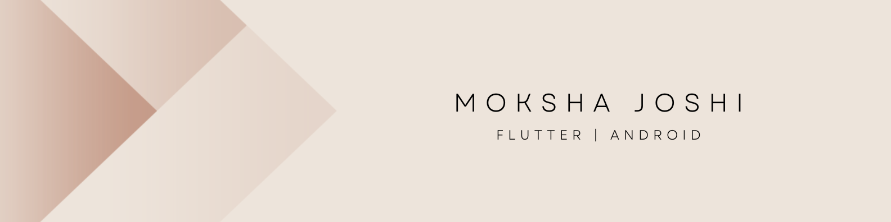
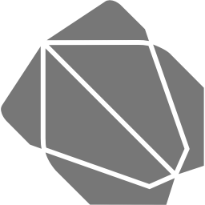
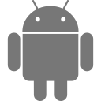
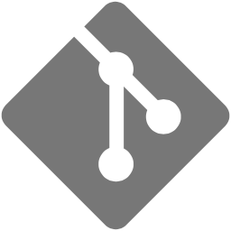
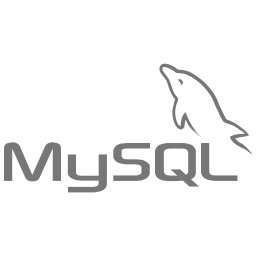
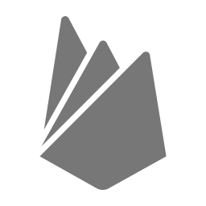

<h2> Hi there 👋, I'm Moksha 👩‍💻   I'm from India 🇮🇳</h2>

 

 Passionate Flutter developer ready to bring my energy and
 skills to the table for team success. My forte
 includes seamlessly integrating APIs, designing responsive
 UIs, and streamlining app performance for peak
 efficiency. Excited to contribute expertise to innovative
 projects and drive impactful solutions.

  

## Skills  
 
&nbsp;&nbsp;
 
&nbsp;&nbsp;
 
&nbsp;&nbsp;
 
&nbsp;&nbsp;

&nbsp;&nbsp;

&nbsp;&nbsp;
 

<!--
**mokshajoshi/mokshajoshi** is a ✨ _special_ ✨ repository because its `README.md` (this file) appears on your GitHub profile.

Here are some ideas to get you started:

- 🔭 I’m currently working on ...
- 🌱 I’m currently learning ...
- 👯 I’m looking to collaborate on ...
- 🤔 I’m looking for help with ...
- 💬 Ask me about ...
- 📫 How to reach me: ...
- 😄 Pronouns: ...
- ⚡ Fun fact: ...
-->
